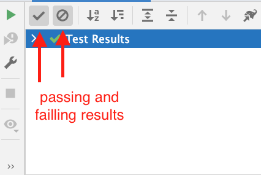

# Archaeological Digging

Consider a ground penetrating camera that can see dinosaur bones. The camera can recognize which bone a specific dinosaur bone is and determine if one bone is resting on top of another bone. The camera produces many lines of output as follows:

`ankle-bone rests on foot-bone`

Archaeologists would like to use this camera to determine which order to dig the bones up in so that if one bone is resting on top of another, they always dig that bone up before the bone that has something resting on it.

Your task is to output a report that tells the archaeologists the order they can dig the bones up in that satisfies the above goal. If no such order is possible your program will output `impossible` on a single line.

Input:

The first line contains an integer n giving the number of bones that the camera has found (n <= 1 000,000,000 (dinosaurs can have lots of bones)), this follows with n lines containing the names of all of the bones that the camera has identified and finally some number of lines containing the `rests on` relationships that the camera has discovered, i.e., all of the bones resting on other bones that the camera has found. Those final lines take the form:

`ankle-bone rests on foot-bone`

where each bone is a hyphenated String of no more than 30 characters and each line contains a bone followed by `rests on` followed by another bone.

Expected Output:

Output n lines of Strings in any valid order, where a valid order is one that lists the bones such that they could be dug up in that order and no bone would be dug up before all of the bones resting on top of it were already dug up first. If no such valid order exists then output: `impossible` on a single line.

Example input:
```text
3
foot-bone
ankle-bone
rib-bone
ankle-bone rests on foot-bone
rib-bone rests on ankle-bone
```

Example valid output:
```text
rib-bone
ankle-bone
foot-bone
```

You are given a starter Intellij idea project for this assignment and a number of test-cases that your code should pass. You can design any solution you like. Your starter project has within the lib directory the algs4.jar file from the textbook, the example code shows how to import code from the book in case you would like to do so.

# Deliverables:

**Note there are 2 due dates with this assignment**

### Deliverable 1

Due: March 30, 2022 12 NOON

commit a solution that passes `Basic 1 Bone Test` and `Basic 1 rests on Test` to your github repository.
there is github auto-grading for the basic test-cases
auto-grading will run when you check in your solution.

points value: 2pts (1 point per basic test-case)

### Deliverable 2

Due April 4, 2022 12 NOON

commit your final solution to your Github repository

points value: remaining 8 points

Notes:

- The testcases for this assignment rely on standard input and standard output. Therefore your code should read input from `System.in` (in java) and write to `System.out`. In this way you can design your full solution with minimal forced interface aside from your driver must be inside `public static void main` in the  `A4Driver.java` file provided.

- even though your solution should appear within `public static void main` of `A4Driver.java` you should architect a proper solution using the data structures and algorithms we have discussed in class.

- the provided intellij project is set-up to work with the algs4.jar library containing the classes from the textbook, which you may incorporate into your solution.

- There may be multiple valid outputs for certain test cases, any valid output is considered a correct answer.

Example java code:

```java
import java.util.*;

public class A4Driver {

  public static void main(String[] args) {

    //read from standard input
    Scanner scanner = new Scanner(System.in);

    //write to standard output
    System.out.println("writing to standard output");
  }
}

```

Grading:

| Gradable | Value |
| ---      | ---   |
| Pass basic tests by first due date | 2 |
| Code readability         |   1    |
| Code design              |   1    |
| Functionality            |   6    |
| Bonus                    |   1    |


Code readability: proper variable name choices, proper method names, and naming conventions followed. Consistent indentation, etc.

Code design: Have you made proper use of OOP? Are the algorithms and data structures you are using readily apparent?

Functionality: Does your code pass all of the test-cases?

Bonus: If your solution is completed by the first due date above +1pt. In other words,1 if you do no further commits after the first due date and your solution is a reasonable attempt at solving the entire assignment you get +1pt.

### Tip: testing results interpretation

If you sometimes feel like it is difficult to see the output from unit-tests you might want to make sure both passing and failing test output is toggled on in the intellij test output window:



When you run tests, if you click both of the above switches so they are grey then you'll see both passing and failing tests (and any output), which might make interpretation easier.
